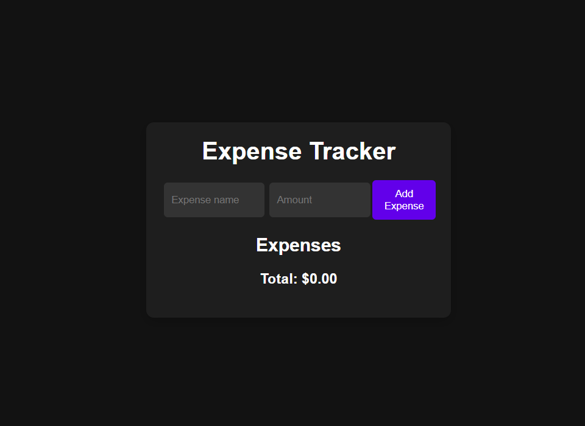

# ExpenseTracker

**ExpenseTracker** — a small web application to track personal expenses using **HTML**, **CSS**, and **JavaScript**.

---

## 🔧 Tech
- **HTML**, **CSS**, **JavaScript**
- No backend required; stores data locally (e.g., `localStorage`)

## ✅ Features
- Add and remove expenses
- View running total of expenses
- Responsive, single-page UI

## 💻 Run locally
1. Clone or download the repository
2. Open `index.html` in your browser

## 📸 Final view

## 💡 Notes
- If the image file isn't present the preview will be empty in GitHub; create an `assets/` folder and add your screenshot image there.
- Contributions and bug reports are welcome — open an issue or submit a PR.

---

**Author:** Gouri Rajmane
